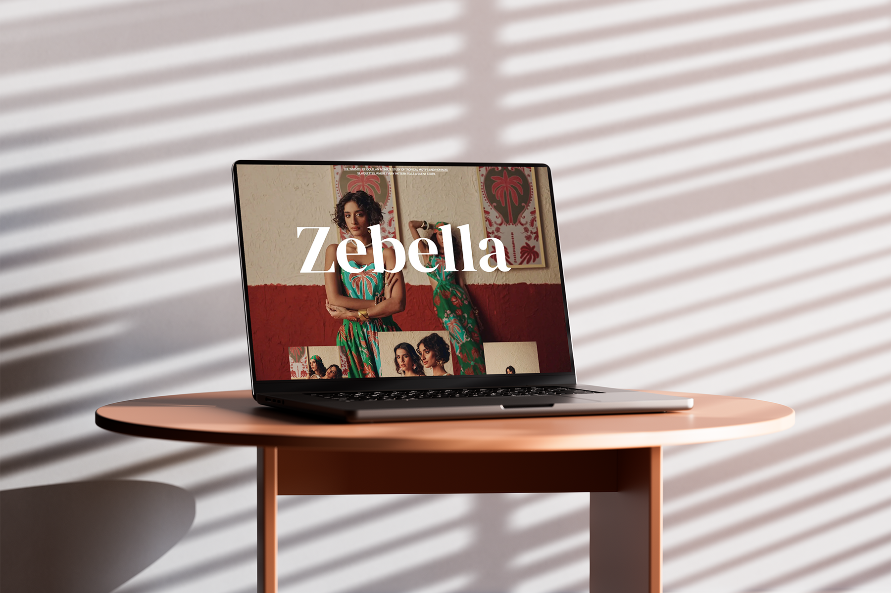

# Zebella Gallery 🌟

Zebella is a vibrant visual sanctuary exploring the intersection of bold tropical prints, artisanal gold, and raw earth textures. Experience nomadic luxury and cultural patterns through a dynamic, scroll-driven interface.

---


**Live Demo:** [Zebella Gallery](https://zebella-gallery.vercel.app/)
---

## Features ✨

- **Scroll-Driven Animations**: Engaging animations that unfold as you scroll, powered by GSAP.
- **Dynamic Grid Layout**: A visually appealing grid of floating images that animate into place.
- **Atmospheric UI**: A high-contrast, light-mode focused design that enhances the visual experience.
- **Performance Optimized**: Leveraging Next.js image optimization with `.webp` format for lightning-fast delivery of high-quality assets.

---

## Concept 🎭

Zebella is a vibrant visual sanctuary exploring the intersection of bold tropical prints, artisanal gold, and raw earth textures. A study in nomadic luxury and cultural pattern.

---

## Layout & Interaction 🗺️

- **Hero Section**: Features a scroll-based text animation with subtle text and background image effects.
- **Main Section**: An interactive grid of floating images arranged for a dynamic scrolling experience.
- **Epilogue Section**: A full-screen background displaying the logo and key links.
- The gallery is driven by user scroll, creating an immersive unfolding experience.

### Implementation Notes

- **Pages and Layout**: Managed under `src/app/` (e.g., `src/app/page.tsx` and `src/app/layout.tsx`) utilizing the App Router.
- **Interactive Components**: Built as components under `src/components/` (e.g., `image-gallery.tsx`, `smooth-lenis-scroll.tsx`).
- **Animation Hooks**:
    - `useTitleAnimation.ts`: For scroll-refined title animations using GSAP.
    - `useMainAnimation.ts`: For scroll-refined main hero image animations using GSAP.
- **Animation Utilities**: GSAP configurations are located in `src/lib/gsap.ts`.
- **Image Assets**: Located in `public/images/`, featuring fourteen optimized `.webp` images (`zebella_1` to `zebella_14`).

---

## Tech Stack 🛠️


### Next.js Highlights

- **App Router**: Modern routing architecture for enhanced performance and layout management.
- **Server Components**: Strategic separation of concerns to minimize client-side JavaScript and improve load times.
- **Image Optimization**: Utilizing `next/image` for automatic resizing, lazy loading, and WebP conversion.

---

## Getting Started 🏁

This project uses **Bun** for package management and execution.

### Installation

```bash
# Clone the repository
git clone https://github.com/rudra-xi/zebella-gallery.git

# Navigate to project
cd zebella-gallery

# Install dependencies
bun install

```

### Development

```bash
# Start the development server
bun run dev
```

Open [http://localhost:3000](http://localhost:3000) with your browser to see the result. The page will automatically reload when you make changes to the code. You can also view any build errors or lint warnings in the console.

### Available Scripts

- `npm run dev` / `bun run dev` – Start the development server.
- `npm run build` / `bun run build` – Create an optimized production build.
- `npm run start` / `bun run start` – Run the production server.
- `npm run lint` / `bun run lint` – Lint the project with Biome.
- `npm run format` / `bun run format` – Format code (Biome / Prettier).

---

## Project Structure 📁

```plaintext
zebella-gallery/
├── public/                        # Static assets & branding
│   ├── images/                    # Zebella image gallery (zebella_1 to 14)
├── src/
│   ├── app/                       # Next.js App Router
│   │   ├── globals.css            # Global CSS
│   │   ├── layout.tsx             # Global layout & metadata
│   │   ├── page.tsx               # Main landing / index page entry
│   │   ├── pages/                 # Scene / page modules
│   │   │   ├── hero.tsx           # Hero section page component
│   │   │   ├── epilogue.tsx       # Epilogue / outro section page component
│   │   │   ├── main.tsx           # Main / core page component
│   │   │   └── index.ts           # Barrel export for page modules
│   ├── assets/                    # Asset constants / imports
│   │   └── images.ts              # WEBP image name imports & constants
│   ├── components/                # Reusable UI components
│   │   ├── primary-text.tsx       # Primary text / typography component
│   │   ├── image-gallery.tsx      # Image gallery component
│   │   ├── animated-title.tsx     # Title animation component
│   │   ├── epilogue-elements.tsx  # Epilogue UI elements component
│   │   ├── smooth-lenis-scroll.tsx# Smooth scrolling layer component
│   │   └── index.ts               # Barrel export for components
│   ├── hooks/                     # Custom React hooks
│   │   ├── useTitleAnimation.ts   # Title animation hook
│   │   └── useMainAnimation.ts    # Main animation hook
│   ├── lib/                       # Third‑party & low‑level config
│   │   └── gsap.ts                # GSAP setup / configuration
├── biome.json                     # Linting & code formatting config
├── bun.lock                       # Bun package lockfile
├── package.json                   # Dependencies & scripts
├── next.config.ts                 # Next.js build configuration
└── tsconfig.json                  # TypeScript configuration
```

---

## Author 🧑‍🦱

[](https://github.com/rudra-xi)

### Contact

[](https://www.linkedin.com/in/goutam-rudraxi)

---

## License 🪪

This project is licensed under the MIT License. See the [](./LICENSE.md) file for more information.
